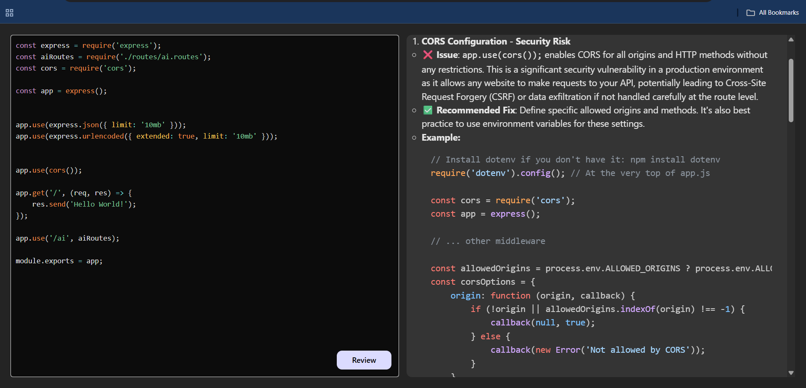

# 🤖 AI Code Reviewer

An intelligent code review assistant powered by **Google Gemini AI**. This application helps developers clean, optimize, and debug their code by providing instant, detailed feedback on quality, security, and performance.


## ✨ Features

- **🚀 AI-Powered Analysis:** Uses Google's `gemini-2.5-flash` model for deep code inspection.
- **⚡ Real-time Feedback:** Instantly identifies bugs, security vulnerabilities, and performance bottlenecks.
- **🎨 Syntax Highlighting:** Beautiful code editor interface using `react-simple-code-editor` and `prismjs`.
- **📝 Markdown Output:** Reviews are formatted in clean, readable Markdown.
- **📂 Full Stack Architecture:** Built with a robust Express backend and a React frontend.

## 🛠️ Tech Stack

**Frontend:**
* React (Vite)
* Axios
* React Markdown
* PrismJS

**Backend:**
* Node.js
* Express.js
* Google GenAI SDK

**Tools:**
* Render (Backend Deployment)
* Netlify (Frontend Deployment)

## 🚀 Getting Started

Follow these steps to set up the project locally.

### Prerequisites
* Node.js installed
* A Google Gemini API Key

### Installation

1. **Clone the repository**
   ```bash
   git clone [https://github.com/YOUR_USERNAME/ai-code-reviewer.git](https://github.com/YOUR_USERNAME/ai-code-reviewer.git)
   cd ai-code-reviewer

2. **Setup Backend**

           

        cd BackEnd
        npm install
 
   * **Create a .env file in the BackEnd folder:**

        ```Code snippet
         PORT=3000
         GOOGLE_GEMINI_KEY=your_api_key_here

   * **Start the server:**

        ```bash
         npm run dev
3. **Setup Frontend**

 * **Open a new terminal.**

       
        cd Frontend
        npm install

   * **Create a .env file in the Frontend folder:**

     ```Code snippet
      VITE_BACKEND_URL=http://localhost:3000
   * **Start the React app:**

     ```bash
     npm run dev
     
## 📸 Screenshots



## 🤝 Contributing

Contributions are welcome! Please feel free to submit a Pull Request.

## 📄 License

This project is licensed under the MIT License.